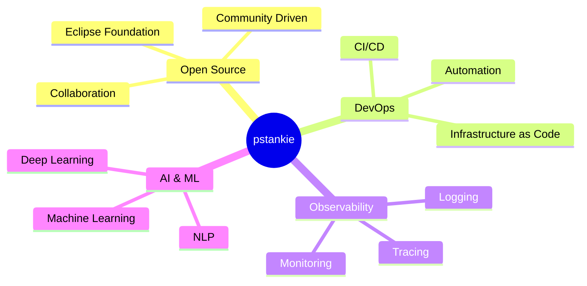

  

  
  
  
  

---

## 🚀 About Me

I'm passionate about **Open Source Software** and actively contributing to the **Eclipse Foundation** ecosystem. My focus areas include:

- 🔧 **Release Engineering & DevOps**: Building robust CI/CD pipelines and infrastructure automation
- 📊 **Observability**: Monitoring, logging, and tracing distributed systems
- 🤖 **AI/ML**: Exploring artificial intelligence and machine learning applications
- ☁️ **Cloud Native**: Kubernetes, containers, and microservices architecture

## 🛠️ Tech Stack & Skills

### DevOps & Cloud

### Observability

### AI & Machine Learning

### Eclipse Foundation & Java

## 📊 GitHub Statistics

  
  

  

## 🌟 Focus Areas

## 🤝 Let's Connect

  
  
  
  

---

  
  ### 💡 "The best way to predict the future is to invent it." - Alan Kay
  
  
  

